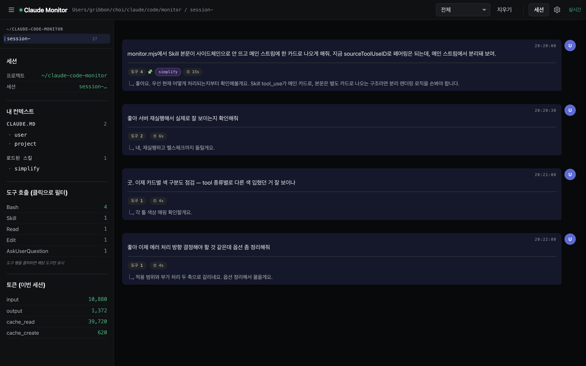
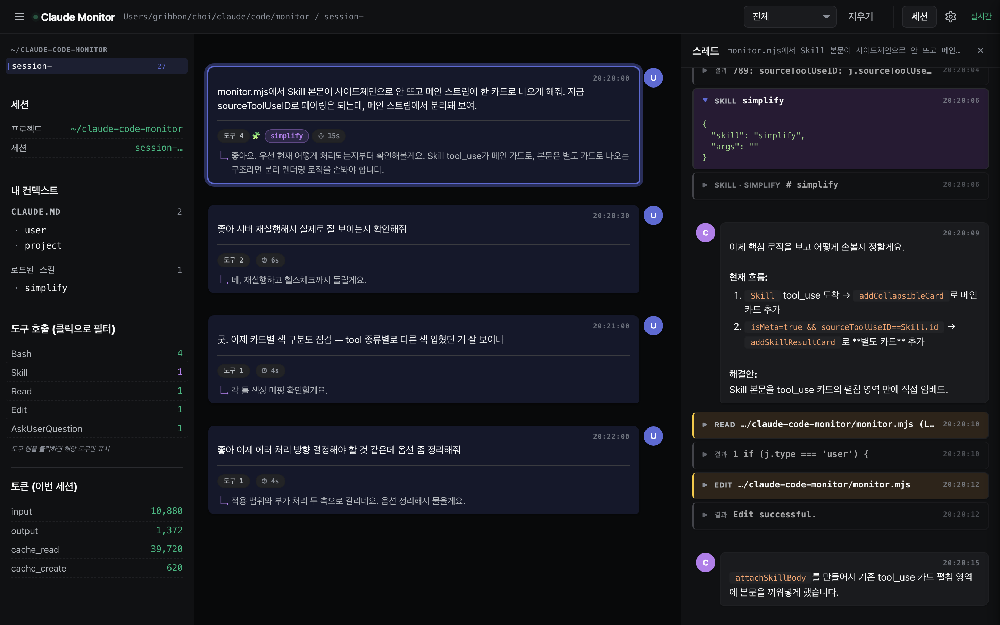
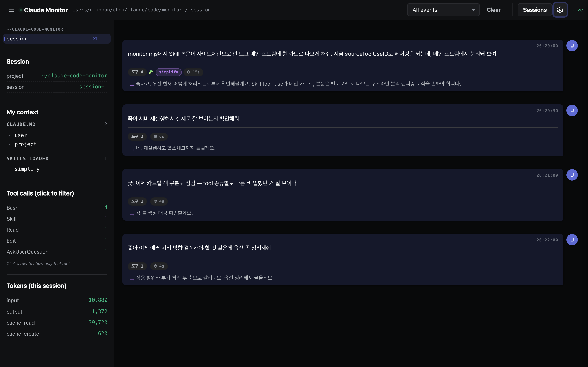

# claude-code-monitor

[English](./README.md) | **한국어**

> Claude Code CLI 세션을 브라우저로 실시간 관찰하는 로컬 단일파일 도구.
> JSONL 세션 파일을 그저 tail할 뿐, CLI를 감싸지도 네트워크로 보내지도 않습니다.



   

---

## ⚡ 30초 시작

```bash
# 1. 클론
git clone https://github.com/OreoChoi/claude-code-monitor.git ~/claude-code-monitor

# 2. 실행
node ~/claude-code-monitor/monitor.mjs

# 3. 브라우저에서 열기
open http://localhost:7777
```

`npm install` 필요 없음. macOS면 `start.command` 더블클릭으로도 실행됩니다.

---

## ✨ 주요 기능

- **턴 단위 카드 스트림** — 사용자 메시지 1개 = 1턴. 클릭하면 그 턴의 모든 도구 호출·결과·텍스트가 우측 드로어로 펼쳐집니다.
- **스킬 본문 인라인 렌더링** — Claude가 `Skill`을 호출하면 로드된 `SKILL.md` 본문이 같은 카드 안에 마크다운으로 표시됩니다. 표·코드블록·리스트 다 보임.
- **"내 컨텍스트" 사이드바** — 지금 Claude가 들고 있는 게 뭔지: 프로젝트 메모리, 로드된 `CLAUDE.md`, 이번 세션에 호출된 스킬.
- **멀티 세션 탭** — 최근 30분 안에 활동한 세션들이 각자 탭으로. 탭별 독립 스트림·카운터.
- **5종 스마트 필터** — 전체 / 스킬+메모리 / 대화+스킬 / 도구만 / 대화만. 사이드바 도구 행 클릭 시 해당 도구로 핀 필터.
- **컬러 코드 도구** — Skill(보라), Bash(녹색), Read·Edit·Write(주황), Web(청록), Agent·Task(빨강).
- **AskUserQuestion 구조화 렌더링** — Claude가 선택지를 물을 때 JSON 덩어리 대신 질문·옵션 카드로 펼쳐 보여줍니다. `(Recommended)` 옵션은 보라 보더로 강조.
- **실시간 토큰 카운터** — input / output / cache_read / cache_create 누적.
- **다국어** — 한국어 / 영어 (설정에서 전환, 브라우저에 저장).
- **무의존성** — Node 표준 모듈만 사용. `monitor.mjs` 단일 파일.

---

## 🖼 화면 미리보기

| 스킬 본문이 펼쳐진 상태 | 영어 UI |
|---|---|
|  |  |

더 많은 화면과 사용법 → **[사용자 가이드](./docs/GUIDE.md)**

---

## 📦 설치

세 가지 방법 중 하나:

**A. 더블클릭 (macOS)**
```bash
git clone https://github.com/OreoChoi/claude-code-monitor.git ~/claude-code-monitor
chmod +x ~/claude-code-monitor/*.command
# Finder에서 start.command 더블클릭
```

**B. 터미널**
```bash
node ~/claude-code-monitor/monitor.mjs
# Ctrl-C로 종료
```

**C. npx (설치 없이)**
```bash
npx -y github:OreoChoi/claude-code-monitor
```

브라우저에서 <http://localhost:7777> 열고, 평소처럼 Claude Code를 쓰면 이벤트가 흘러들어옵니다.

---

## 🧠 어떻게 동작하나

Claude Code는 모든 메시지·도구 호출·결과·토큰 사용량을 `~/.claude/projects/<slugified-cwd>/<session-id>.jsonl`에 한 줄씩 기록합니다. 이 도구는:

1. 500ms마다 해당 경로를 스캔해 최근 30분 안에 변경된 `.jsonl` 파일을 찾음
2. 각 활성 세션을 탭으로 등록하고, 마지막 체크 이후 추가된 바이트만 읽음
3. 새 라인을 SSE로 모든 연결된 브라우저에 broadcast
4. 브라우저가 라인을 분류해 카드로 렌더링

자세한 동작 원리·트러블슈팅·FAQ는 [GUIDE.md](./docs/GUIDE.md).

---

## 🔒 프라이버시

전부 로컬. 서버는 `localhost:7777`에만 바인딩. 텔레메트리·외부 호출·분석 없음.

## 📋 요구사항

- Node.js 18+
- macOS 또는 Linux (`.command` 런처는 macOS 전용)
- Claude Code CLI 설치 (`~/.claude/projects/`가 존재해야 함)

## 📝 라이선스

MIT — [LICENSE](./LICENSE) 참조.
