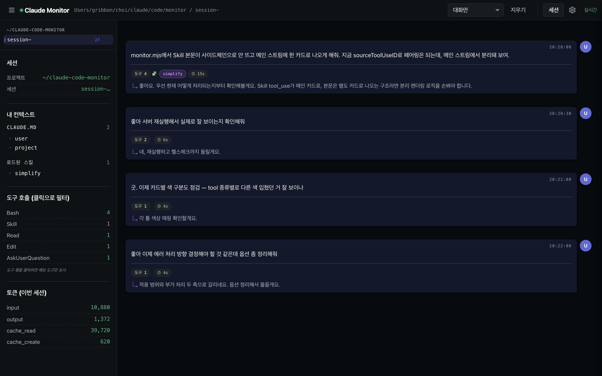
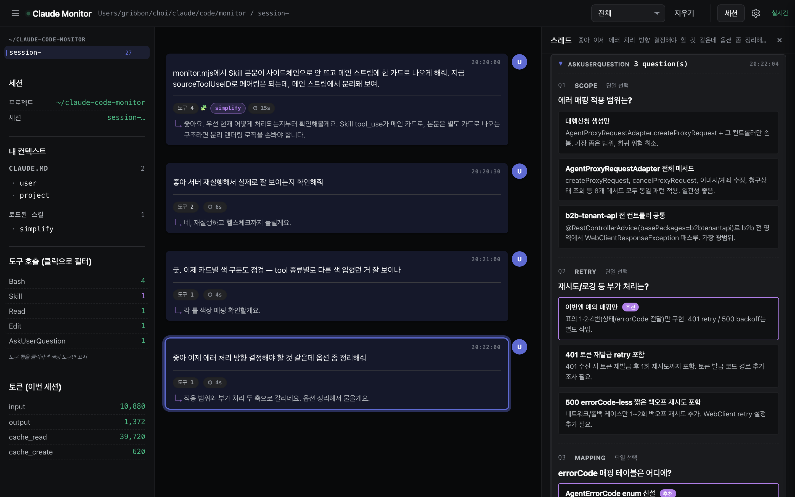

# User Guide

**English** | [한국어](./GUIDE.md)

A guide for first-time users of `claude-code-monitor`.
The README covers how to get it running in 30 seconds — this is about **how to actually use each feature**.

---

## 1. What is this?

A local tool that tails the JSONL of your Claude Code CLI sessions and shows, in your browser, **what Claude is looking at and what it's doing** right now.

### When to use it

- **Watch Claude work in real time** — what tools it calls, which skills it loads, what memory it references
- **Track token usage** — input / output / cache_read / cache_create accumulated per session
- **Debug** — "that call looked off, let me see the raw input/result" → expand a card
- **A local sidecar** — keep it open on the side while you work

### What it is *not*

- ❌ A Claude CLI wrapper/proxy (the CLI is untouched; we only observe files)
- ❌ Cloud-synced (everything local)
- ❌ Permanent session storage (current default: 30-minute window)
- ❌ Multi-user / auth / team sharing

---

## 2. Getting started (5 min)

### Requirements

| Item | Required |
|---|---|
| OS | macOS or Linux (`.command` launchers are macOS-only) |
| Node.js | 18+ |
| Claude Code CLI | Installed (so `~/.claude/projects/` exists) |
| Port | 7777 (fixed) |

### Three install options

**A. npx (fastest, no install)**
```bash
npx -y github:OreoChoi/claude-code-monitor
```

**B. Clone + double-click (macOS — recommended if you'll use it often)**
```bash
git clone https://github.com/OreoChoi/claude-code-monitor.git ~/claude-code-monitor
chmod +x ~/claude-code-monitor/*.command
# Double-click start.command in Finder → runs in background
# Double-click stop.command to stop
```

**C. Run directly in terminal**
```bash
node ~/claude-code-monitor/monitor.mjs
```

### First run

1. Start the server (any of the three above)
2. Open <http://localhost:7777> in a browser
3. Use Claude Code normally (run `claude` in any project)
4. Cards should flow into the page

> If nothing shows up, don't panic. Sessions must have been modified within the last 30 minutes to be picked up. Type one message into Claude Code and the session activates.

---

## 3. UI tour


### Top header
- `Claude Monitor` logo + the **project path / session ID** of the active tab
- Right side: **filter dropdown** / `Clear` (empty current stream) / `Sessions` (past session browser) / `Settings` gear / connection badge (`live`)

### Tab area
- One tab per active session
- Number on the right = card count for that tab
- × closes the tab (server-side session is untouched)

### Left sidebar
| Block | Contents |
|---|---|
| **Session** | Project path and session ID of the current tab |
| **My context → CLAUDE.md** | CLAUDE.md files loaded into this session (user / project / project-local) |
| **My context → Skills loaded** | Skills invoked in this session |
| **Tool calls (click to filter)** | Call count per tool. Click a row → pin-filter to that tool only |
| **Tokens (this session)** | Accumulated input / output / cache_read / cache_create |

### Main area — turn cards
Each user message = one turn card. The card shows:
- The user message body
- Tool count, skill chips, and elapsed time for that turn
- A one-line preview of the assistant's reply

**Click the card** → a thread drawer opens on the right with **every event** in that turn (tool calls, results, text, thinking) in chronological order.

### Card types

| Class | Trigger | Render |
|---|---|---|
| `user` | User message | Plain text, starts a new turn |
| `assistant text` | Claude text | GFM markdown |
| `tool_use` | Tool call | Collapsible, color-coded left border |
| `tool_use` · AskUserQuestion | Tool that asks the user | Expands into a structured card layout for each question (see 4.9) |
| `tool_result` | Tool result | Collapsible, paired with preceding `tool_use` |
| `tool_result-skill` | Skill body | `SKILL.md` body rendered as markdown |

---

## 4. Features in use

### 4.1 Multi-session tabs

Run `claude` in multiple projects simultaneously and each session gets its own tab. Click to switch, × to close.

Tab state is saved in `localStorage` so it survives reloads.

### 4.2 Expand a Skill body


1. A purple chip like `simplify` on a turn card means a skill was invoked in that turn
2. Click the turn card → the thread drawer opens
3. Click the purple-bordered `Skill` card inside the drawer → the `SKILL.md` body unfolds as markdown
4. Tables, code blocks, and lists all render

### 4.3 See what Claude actually loaded — "My context"

The sidebar **My context** block shows:
- Which `CLAUDE.md` files are loaded into this session
- Which skills have been invoked

Built once at session-register time, with skills appended as they're called.

### 4.4 The 5 filters



Switch using the top dropdown:

| Filter | Shows |
|---|---|
| **All events** | Every card |
| **Skills + memory only** | Skill calls and memory-related events |
| **Conversation + Skills** | User/assistant text + skill bodies |
| **Tools only** | tool_use / tool_result |
| **Conversation only** | User/assistant text |

Use **Conversation only** to skim the dialogue, **Tools only** to study tool-call patterns.

### 4.5 Pin a tool (sidebar click)

In the sidebar **Tool calls** section, click a row → only that tool's cards are shown. Click again to unpin.

Example: click `Edit` → only this session's `Edit` calls remain visible.

### 4.6 Turn dividers map question → result

Each user message starts a visually-separated new turn. Useful for "which question triggered this action?".

### 4.7 Track token usage

The **Tokens** block accumulates four numbers:

| Field | Meaning |
|---|---|
| `input` | New input tokens sent to the model |
| `output` | Tokens generated by the model |
| `cache_read` | Tokens read from prompt cache (cheap) |
| `cache_create` | Tokens that newly wrote to the prompt cache |

In long sessions, a large `cache_read` is a sign that caching is working.

### 4.8 KR / EN toggle

Settings (gear icon, top right) → **Language** dropdown → 한국어 / English.

UI chrome only — user/assistant content is preserved as written.
Stored in `localStorage`.

### 4.9 Structured rendering for AskUserQuestion



When Claude calls the `AskUserQuestion` tool to present choices to the user, the raw payload is deeply nested JSON (`{questions: [{question, header, options: [{label, description}, ...]}, ...]}`). Expanding it as a flat JSON dump is hard to scan, so the monitor renders this specific tool with a dedicated layout.

What you see when expanded:

- Each question gets a `Q1` / `Q2` index, a **header chip** (e.g. `SCOPE`, `RETRY`), and a **Single / Multi** badge
- The question text is bold
- Each option is a separate card showing `label` (bold) and `description` (muted)
- Options ending in `(Recommended)` (or the Korean `(추천)`) get a **purple border and a "추천" badge**; the trailing `(Recommended)` text is stripped automatically

Other tool calls still render as the usual JSON `<pre>` block.

---

## 5. FAQ

**No cards appear**
- No active session. Type one message into Claude Code and the session activates.
- Sessions must have an mtime within the active window. Default is 30 min; configurable via `/config` (1 min – 24 hr).

**Port 7777 is already in use**
- Check what's holding it: `lsof -ti :7777`
- Kill and restart: `lsof -ti :7777 | xargs kill -9 && node monitor.mjs`

**Can I see older sessions?**
- Top-right **Sessions** button → a browser opens for every session, including ones outside the active window.

**Does any data leave my machine?**
- No. Binds to `localhost:7777` only, no telemetry. Browser fetches only from your local machine.

**Thinking looks empty**
- Anthropic encrypts (redacts) thinking blocks for some calls. Only plaintext thinking can be displayed.

**A tab disappeared**
- A session with no mtime change for >30 min is auto-expired. Reactivate it and the tab returns.

---

## 6. Stop / restart

**Stop**
- Started via double-click: double-click `stop.command`
- Started in terminal: `Ctrl-C`
- Started in background: `pkill -f "claude-code-monitor/monitor.mjs"`

**Restart (after code change)**
```bash
pkill -f "claude-code-monitor/monitor.mjs"
nohup node monitor.mjs > /tmp/claude-code-monitor.log 2>&1 & disown
curl -s -o /dev/null -w "%{http_code}\n" http://localhost:7777   # expect 200
```

---

## 7. Known limits

- **500 ms polling** — events appear with up to ~1 s delay. No token-by-token streaming (Claude Code only writes completed messages to JSONL)
- **Sessions outside the 30-min window are not shown in the main view** — open them explicitly via the Sessions browser
- **macOS-focused testing** — the Node script runs on Linux, but `.command` launchers are macOS-only
- **Model internals are not exposed** — Anthropic's redacted thinking is encrypted and unreadable

---

## 8. Troubleshooting

**Log location**
- Background run: `/tmp/claude-code-monitor.log`
- Foreground (terminal): stderr/stdout in the terminal

**Health check**
```bash
curl -s -o /dev/null -w "%{http_code}\n" http://localhost:7777   # expect 200
curl -s http://localhost:7777/health
curl -s http://localhost:7777/sessions
```

**Connection state (browser)**
- Top-right `live` badge green → SSE connection alive
- Red → server is down; restart

**Report an issue**
- Bugs / suggestions: https://github.com/OreoChoi/claude-code-monitor/issues
